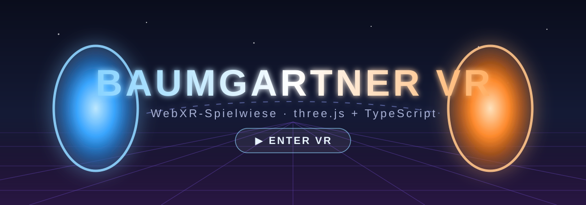

# Baumgartner VR

**Live: https://baumgartner-games.github.io/vr/**

[](https://baumgartner-games.github.io/vr/)

WebXR-Spielwiese als Basis für weitere VR-Spiele und Experimente: Hub-Welt,
Portal Labor, Schießstand und Dust, ein Werkzeuggürtel voller Spielzeug und
Peer-to-Peer-Sitzungen ohne eigenen Server. three.js + TypeScript + Vite, ohne
externe Assets — alles wird prozedural gebaut.

> **Hinweis für Agenten:** Entwickelt und gepusht wird **direkt auf `main`** —
> kein Feature-Branch, kein Pull Request, solange nichts anderes im Auftrag
> steht. Das ganze Projektwissen — Features im Detail, vollständige Steuerung,
> Architektur, Portale, Netzwerk, Deployment — steht in **[AGENTS.md](AGENTS.md)**.

## Entwicklung

```bash
npm install
npm run dev      # http://localhost:5173
npm run build    # Typecheck + Produktionsbuild nach dist/
npm run preview  # gebautes Ergebnis lokal servieren
npm test         # Jest
```

WebXR braucht einen sicheren Kontext; `localhost` reicht, für die Brille im
selben WLAN am einfachsten über HTTPS-Tunnel oder `vite dev --https`.

## Tests

Jest testet die reine Rechen-Logik ohne Browser — Ferngreifen, Achsenzuordnung,
Werkzeug-Pose, Handhaltung, Waffenwerte, Zielrichtung und Konfig-Code. Diese
Module kommen ohne three.js und Rapier aus, deshalb braucht Jest weder WebGL
noch WebXR. Was schwer zu testen ist, gehört möglichst in so ein Modul — der
Rest bleibt Verdrahtung.

## Query-/Hash-Parameter

| Parameter | Wirkung |
| --- | --- |
| `#portal` | startet direkt in dieser Welt (jede Welt-ID funktioniert) |
| `?world=portal` | dasselbe als Query-Parameter |
| `?room=mond-riff-47` | trägt den Raum-Code ins Verbindungs-Formular ein (Einladungslink) |
| `?net=local` | nutzt `BroadcastChannel` statt WebRTC — zwei Tabs auf einem Rechner |

Im Browser liegt die App zum Debuggen auf `window.bgvr`.

## Steuerung

| | VR | Desktop | Handy |
| --- | --- | --- | --- |
| Bewegen | linker Stick (reindrücken = Sprint) | `WASD`, `Shift` | linker Touch-Stick |
| Umsehen | Kopf, rechter Stick = Snap-Turn | Maus (Klick = Pointer-Lock) | wischen |
| Springen / Ducken | `A` rechts / rechten Stick reindrücken | `Leertaste` | – |
| Menü | Button an der linken Hand | `Menü` im HUD | `Menü` im HUD |
| Auswählen | zielen + Trigger oder `A` | Linksklick | tippen |
| Werkzeug nehmen/ablegen | Grip an der Hüfte, Grip loslassen | – | – |
| Werkzeug benutzen | Trigger (Greifen = zweite Funktion) | Links-/Rechtsklick | – |
| Aufheben / werfen | Grip mit leerer Hand am Objekt | – | – |
| Ferngreifen | zielen, Grip, Hand >30° nach oben kippen | – | – |
| Zurücksetzen | `B` / `Y` oder Menü | `R` oder Menü | Menü |

Die vollständige Tabelle samt aller Werkzeuge steht in [AGENTS.md](AGENTS.md#steuerung).

## Konfig-Code

Werkzeug-Posen, Handhaltungen, Anbauteile und Waffenwerte passen zusammen in
eine kopierbare Zeile (`BGVR1…`) — in VR unter *Einstellungen → Konfig-Code*,
am Rechner über die Kommandozeile:

```bash
npm run config -- decode BGVR1…        # zeigt die Einstellungen als JSON
npm run config -- encode config.json   # macht wieder einen Code daraus
npm run config -- mirror BGVR1… left   # linke Handhaltungen nach rechts
```
