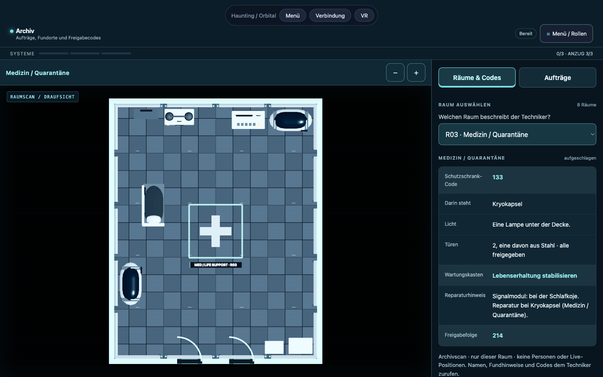
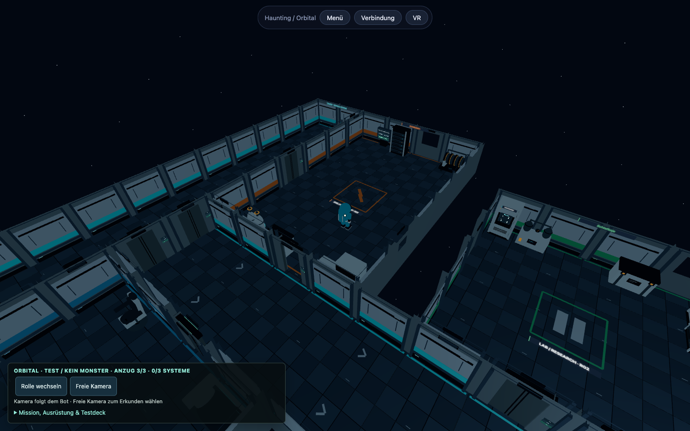
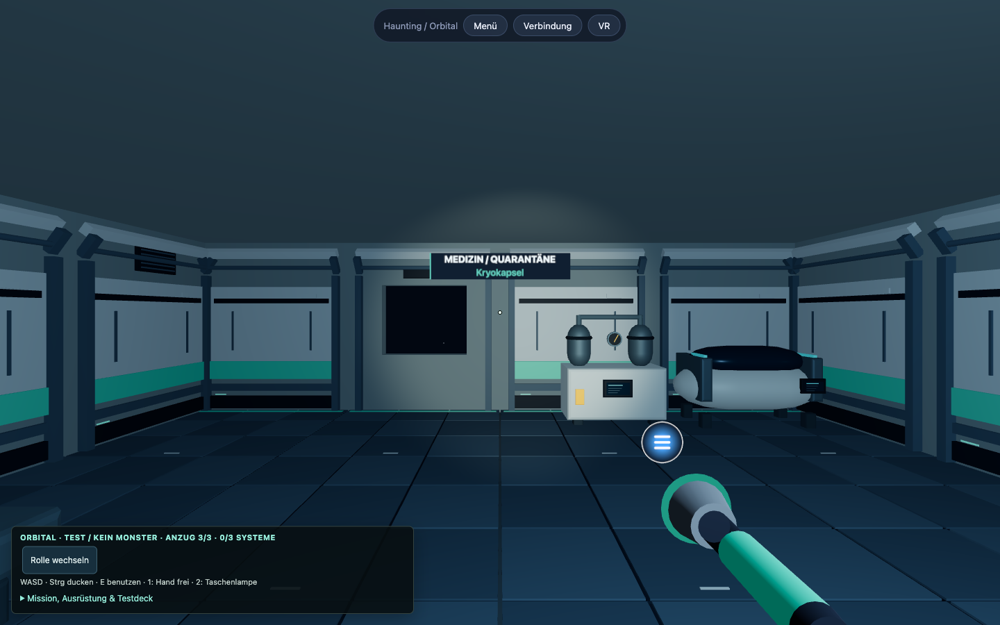

# Orbital: Umsetzung und Prüfung · 9. September 2026

Die Station verwendet eigene prozedurale Sci-Fi-Modelle und einen an The Skeld
orientierten Aufbau mit getrennten Räumen und umlaufenden Gängen. Sie ist kein
Asset- oder Kartendatenimport aus Among Us.

## Umgesetzt

- Schutzschrank mit beleuchtetem Ausgang, Tod/Sieg mit Neustart. Schränke lassen
  sich nur aus ihrem eigenen Raum bedienen; Nachbarwände werden nicht umgangen.
- Vorhandene Taschenlampe als Startwerkzeug und aufnehmbares Web-Objekt;
  Radar/Röntgen als physische Werkzeuge mit gemeinsamem Gehäuse und Gürtelablage.
- Raumakten mit echten einzelnen Draufsichten, Codes und Reparaturhinweisen.
  Keine Gesamtkarte oder Gegneridentifikation für das Archiv.
- Mikrofonreaktion entfernt; optionaler Sprachchat bleibt unabhängig.
- Näherungsschotts mit beidseitiger Statusleuchte, belegte Durchgänge bleiben frei.
  Die Übungsdecktür löst keinen Neustart mehr aus.
- Kurvenflug mit Kollisionsprüfung, Beschleunigung und Netzinterpolation.
- Weltraum statt unendlicher Bodenfläche, größere Raumvielfalt und frühe
  Kondensation mit Atemwolken und Tropfen.
- Vollständige beobachtbare Botmission: Fracht, drei echte Reparaturen, Heimkehr.
  Am Desktop folgt die Kamera dem Bot; **Freie Kamera** erlaubt eigenes Erkunden.
  Im XR-Headset wird der Blick nicht automatisch nachgeführt.
- Eingeschaltete Decks erhalten etwas indirektes Licht; stromlose Räume und der
  dunkle Test bleiben ohne globale Aufhellung.
- Sichtbare Rollenwechsel; Leistungsanzeige standardmäßig aus, über F3 verfügbar.
- Webansicht ohne verdeckende eigene Avatarteile und ohne geometrischen
  Lampen-Hilfskegel; das echte Taschenlampenlicht bleibt erhalten.

## Reproduzierbare Prüfungen

```sh
npm ci
npm run typecheck
npm run lint
npm run format:check
npm test -- --runInBand
npm run build
npm run test:browser:install
npm run dev
# in einem zweiten Terminal:
npm run test:browser -- --loops=2 --bot-seconds=30
```

Der Loop startet standardmäßig **Chromium und Firefox in sichtbaren Fenstern**.
Für lokale Vergleiche läuft er mit der normalen Grafik-Konfiguration des Browsers;
er erzwingt keinen Software-Renderer. Die Installation verwendet die zur
Playwright-Version im Lockfile passenden Browser. Ein schon installiertes Firefox
mit einer anderen Playwright-Protokollversion ist kein verlässlicher Ersatz.

| Option | Wirkung |
| --- | --- |
| `--browser=chromium` / `--browser=firefox` | Nur diesen Browser prüfen. |
| `--loops=2` | Mit frischen Browserkontexten wiederholen. |
| `--bot-seconds=30` | Die Bot-Demo 30 Sekunden beobachten; Standard: 12 Sekunden. |
| `--url=http://127.0.0.1:4173/` | Einen laufenden Produktions-Preview statt Vite verwenden. |
| `--output=.artifacts/browser-smoke/review` | Screenshots und Report in diesem Verzeichnis ablegen. |
| `--headless` | Ohne sichtbares Fenster testen; in CI automatisch aktiv. |
| `--software` | Nur bei Bedarf: Chromium mit SwiftShader starten. |

Ein Headless- oder Softwarelauf ist ein zusätzlicher Funktionscheck. Seine
Darstellung und Bildrate ersetzen keinen Vergleich mit der normalen
Grafik-Konfiguration. Für verwertbare Zeitmessungen bleibt die Browserseite im
Vordergrund; parallel laufende Builds, Jest-Suiten und Hot-Reload-Änderungen sollten
vor dem Vergleich beendet sein.

Screenshots und `report.json` stehen unter `.artifacts/browser-smoke/`; sie werden
nicht automatisch ins Repository übertragen. Die Generation `acceptance/` enthält
die unten dokumentierten erfolgreichen Browserläufe. Die drei ausgewählten Bilder
unter [docs/orbital](orbital/) sind unveränderte Screenshots ohne Personen- oder
Kontodaten. Frühere Generationen wie `refined/` bleiben Zwischenstände: vorhandene
Screenshots allein bedeuten keinen erfolgreichen vollständigen Testlauf.

Die Logik- und Physiktests prüfen insbesondere komplette Botrunden mit physisch
öffnenden Schotts, Kurvenfreiheit, Layout/Modellmaße, Schutzschrank-Ausgang und
Neustart mit tatsächlichen Controller-Zeigerstrahlen, Werkzeuggriffe, Raumakten
und Host-/Snapshotwechsel. Der funktionale Routenplan bleibt vom tatsächlich
geöffneten Türblatt getrennt; gesperrte Türen blockieren beide.

Die Browserprüfung bedient Rollen, Raumwahl, Zoom, Aufträge, Kontrollschalter,
Drohne und Bot-Demo in der echten WebGL-App. Sie stellt den Desktopspieler über
den Debugkontext vor die schwebende Lampe und nimmt diese mit dem tatsächlichen
`E`-Eingabepfad auf. Für Tod/Neustart setzt das Setup gezielt den Verlustzustand;
der Test betätigt anschließend die sichtbare Neustartschaltfläche und verlangt
eine laufende Runde mit wiederhergestellten Trefferpunkten. Der Archivlauf prüft Desktop und
Telefonbreite sowie das Fehlen von Gesamtkarte und Entitätenjournal. Er startet
für jeden Durchlauf einen eigenen lokalen Raum (`net=local`); dies ist kein
Mehrgerätetest über das Internet.

Im JSON-Report bedeuten die Felder:

- `passed`, `failure`, `pageErrors` und `consoleErrors`: Ergebnis, Abbruchursache
  und gesammelte Browserfehler. Ein fehlgeschlagener Lauf kann bereits Screenshots
  erzeugt haben. Unbehandelte JavaScript-Fehler führen zum Fehlschlag;
  Konsolenmeldungen sind zusätzlich zu prüfen.
- `steps`: durchlaufene Ansichten mit zugehörigen Screenshot-Dateien.
  `mobileLayout` hält die tatsächlichen Scan-/Aktenmaße und horizontalen Überlauf fest.
- `botStart`, `botEnd` und `botText`: Botpositionen, Zahl erledigter Reparaturen und
  sichtbares Protokoll. Ab zehn Beobachtungssekunden fordert der Smoke eine
  Positionsänderung von mehr als 0,5 Metern. Das belegt Bewegung im beobachteten
  Zeitraum; eine komplette Mission prüft separat der Bot-Integrationstest.
- `webgl`: Kontextzustand, Zeichenpuffergröße, Renderer und — sofern vom Browser
  freigegeben — Grafikgerät. Ein verlorener WebGL-Kontext lässt den Test scheitern.
- `frameTiming`: kurzes `requestAnimationFrame`-Messfenster nach der Botbeobachtung,
  mit Dauer, Frames, mittlerer Rate und 95. Perzentil der Frame-Abstände. Das ist
  weder ein GPU-Timer noch eine Headsetmessung. Der Smoke setzt keine
  hardwareabhängige Mindestbildrate als Erfolgskriterium.

## Belegter Browserstand

Der übernommene [Browserreport](orbital/browser-report.json) aus
`acceptance/report.json` dokumentiert **vier erfolgreiche Durchläufe** gegen den
lokalen Produktions-Preview auf Port 4173: zweimal Chromium und zweimal Firefox.
Der lokale absolute Ausgabepfad wurde in der Dokumentationskopie durch seinen
Repository-relativen Pfad ersetzt; alle Mess- und Prüfergebnisse sind unverändert.
Alle vier meldeten keine unbehandelten JavaScript-Fehler, keine Konsolenfehler,
keinen verlorenen WebGL-Kontext und keinen horizontalen Überlauf bei 390 Pixeln
Telefonbreite. Die Läufe bestätigen E-Lampenaufnahme, Verlustanzeige mit Neustart
und tatsächliche Botbewegung. Im kurzen Beobachtungsfenster waren die Reparaturen
noch nicht abgeschlossen; ein vollständiger Browser-Missionssieg wird daraus
nicht abgeleitet.

Die folgenden kurzen Frame-Samples stammen vom lokalen Mac während parallel
laufender Entwicklungs-/Jest-Last. Sie dienen der Diagnose, sind keine isolierte
Leistungsmessung und erlauben keine Aussage über Quest-Bildraten:

| Browserlauf | Gemessene Rate | p95 Frame-Abstand |
| --- | ---: | ---: |
| Chromium 1 | 27,2 FPS | 50,6 ms |
| Chromium 2 | 46,5 FPS | 34,3 ms |
| Firefox 1 | 37,3 FPS | 35,2 ms |
| Firefox 2 | 39,0 FPS | 49,1 ms |

Chromium meldete **ANGLE Metal / AMD Radeon Pro 5500M**. Firefox meldete den
generischen Gerätewert „Radeon HD 3200 Graphics, or similar“; dieser Wert wird
nicht als tatsächliches GPU-Modell interpretiert. Die Zeichenpuffer waren jeweils
1440 × 900 Pixel groß. Nach den letzten Korrekturen wurden zusätzlich je ein
Chromium- und Firefox-Lauf einschließlich Testbesuch im Missionsraum erfolgreich
ausgeführt (`release/`).
[Der zusätzliche Report](orbital/release-report.json) hält diese beiden Läufe fest.

Die abschließende Gesamtsuite besteht aus **185 bestandenen Suiten mit 2687
bestandenen Tests** (311 Sekunden im lokalen Lauf). Typecheck, ESLint,
Formatprüfung und Produktionsbuild sind ebenfalls erfolgreich. Der Build meldet
weiterhin große Three.js-/Physik-Chunks; eine Prüfung der Quest-Ladezeiten und
Speichernutzung ist Teil der noch offenen Hardwareabnahme.

[Archiv am Desktop](orbital/archive-desktop.png) ·
[Botbeobachtung mit nachgeführter Kamera](orbital/bot-observation.png) ·
[Raumakte in Firefox bei Telefonbreite](orbital/archive-mobile-firefox.png)

[Raum aus Spielerhöhe](orbital/technician-room.png)







## Laufende Browserprüfung in CI

[`.github/workflows/browser.yml`](../.github/workflows/browser.yml) ergänzt die
bestehenden Projektprüfungen bei Push auf `main`, Pull Requests und manuellem
Start. Der Workflow baut das Spiel, startet den Produktions-Preview und führt
einen Chromium-Smoke mit Software-Renderer aus. Er prüft Rollen, Werkzeuge,
Neustart und Botbeobachtung; der CI-Lauf ist ein Funktionstest, kein nativer
Grafikbenchmark. Screenshots und Report werden auch nach einem Fehler als
**orbital-browser-review** hochgeladen und **14 Tage** aufbewahrt. Firefox bleibt
zusätzlich über den lokalen Browserloop prüfbar.

Die beiden aufwendigen Layout-/Art-Testsuiten wurden ohne gestrichene Seeds,
Gehweg-Samples oder Türprüfungen beschleunigt. Der gezielte lokale Vergleich
ergab 131 statt 466 Sekunden für beide Suite-Laufzeiten. Weiterhin geprüft
werden unter anderem alle 400 Kombinationen aus Seed und Raumzahl.

## Verbleibende Abnahme

Die bisherige lokale Browserprüfung erfolgt auf einem Mac. Sie ist keine
Quest-Abnahme. Ein echter Quest-Test mit Controllern, Handtracking und Haptik sowie ein
Mehrgerätetest mit Quest und zwei Telefonen über WebRTC stehen aus. Eine
Bildrate auf Quest 3 wurde hier nicht gemessen. Produktionsreife erfordert
zusätzlich diese Hardwareabnahme und weitere Spieltests mit einer echten Crew.
